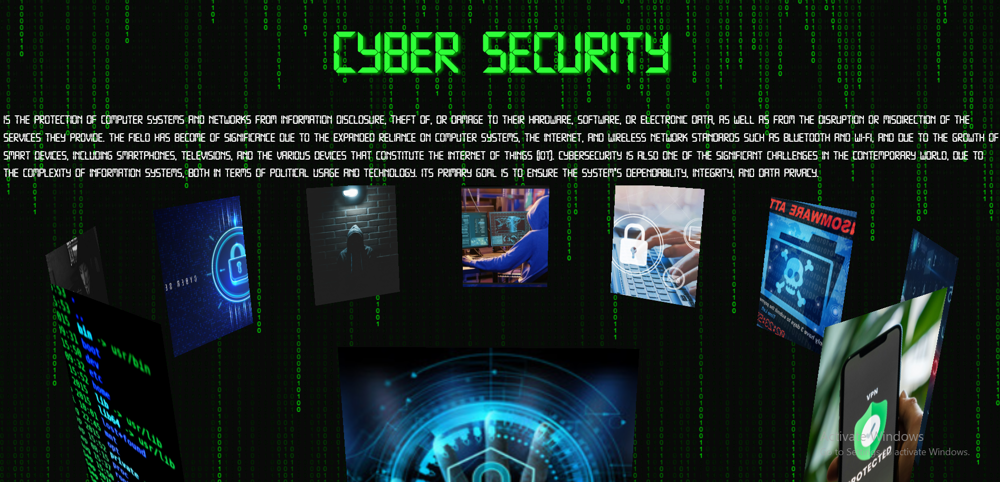

# 🔐 Introduction to Cybersecurity

An interactive web-based project built with HTML, CSS, and JavaScript to introduce users to the fundamentals of cybersecurity. This isn't just another information site — it's a fun, engaging experience that makes you feel like a real hacker! Whether you're curious about common cyber threats or thinking about a career in the cybersecurity field, this site is the perfect starting point. Learn, explore, and interact with the basics of cybersecurity in a playful and educational way.

---

## 📸 Demo



[🔗 Download Live Demo ](Demo.mp4)

---

## 🧠 Features

- Introduction to CyberSecurity concepts.
- Help anyone want to know about CyberSecurity Field.
- Simple and clean UI using HTML and CSS.
- Interactive elements with JavaScript.
- Responsive design for desktop and mobile.
- Funny Websites about CyberSecurity

---

## 🏗️ Built With

- HTML5
- CSS3
- JavaScript (Vanilla JS)

---

## 🚀 Getting Started

### 1. Clone the Repository
```bash
git clone https://github.com/EbraamSobhy/cyber-security.git
cd cyber-security
